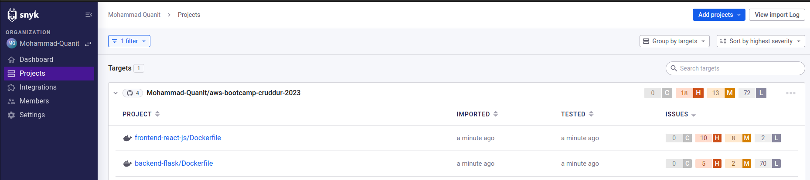
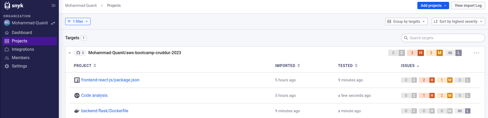
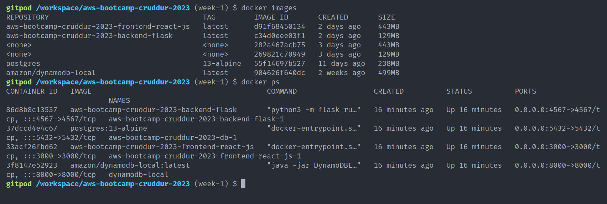
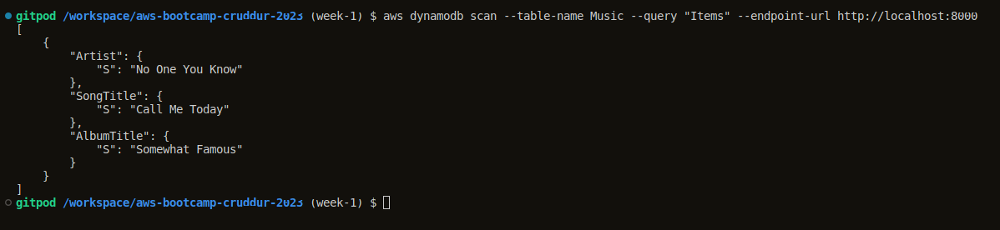
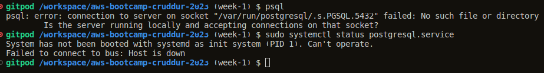
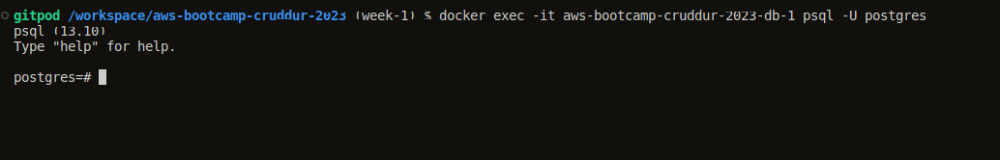
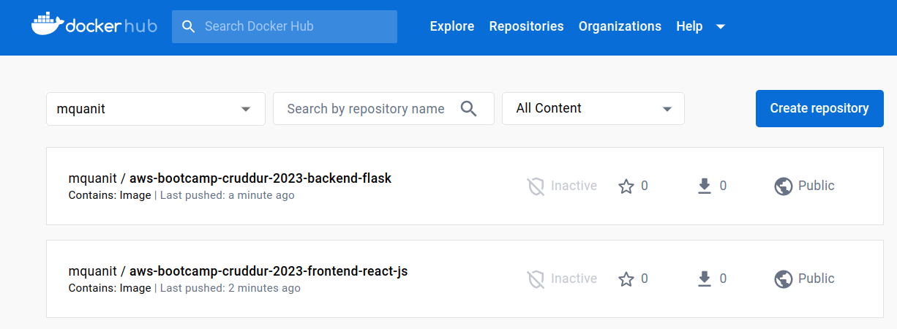

# Week 1 — App Containerization

## Run locally & containerizing the Backend (Python Flask App)

After watching your live stream, below are the steps I've done to run BE environment locally & then containerize python application

<br />

### **Security Considerations**
After watching Ashish's container security [video](https://www.youtube.com/watch?v=OjZz4D0B-cA&list=PLBfufR7vyJJ7k25byhRXJldB5AiwgNnWv&index=26&t=193s), I learned about:

- **Snyk**, A developer security platform to find vulnerabilities, malicious code, secret-leaks in your containers, images or any project source code.

- **AWS Secrets Manager**, an AWS service to store any kind of secrets/variables that we could use in our AWS infra, like in EC2, ECR, ECS, etc.

- **AWS Inspector**, an AWS vulnerability management service that continuously scans your AWS workloads for software vulnerabilities and unintended network exposure.


I've also implemented `Snyk` with my github repository and found out some issues as you see below in screenshot:



So after inspecting above screenshot, what I need to do is to change `Base image` in dockerfile for both of the FE & BE images.



I've succesfully managed to reduced some security issues backend dockerfile and completely removed all issues from frontend dockerfile.

<br />

### **Spending Considerations**

<br />

# **Practical Implementaion**

### **Run BE Server locally & Dockerized it**

``` bash
cd backend-flask
export FRONTEND_URL="*"
export BACKEND_URL="*"
pip install -r requirements.txt
python3 -m flask run --host=0.0.0.0 --port=4567

```
After running these commands, i've made sure that

- Click the unlock button to make the port public for access
- Access the BE server using `http://127.0.0.1:4567/api/activities/home`

``` bash
gitpod /workspace/aws-bootcamp-cruddur-2023/backend-flask (week-1) $ python3 -m flask run --host=0.0.0.0 --port=4567
 * Debug mode: off
WARNING: This is a development server. Do not use it in a production deployment. Use a production WSGI server instead.
 * Running on all addresses (0.0.0.0)
 * Running on http://127.0.0.1:4567
 * Running on http://10.0.5.2:4567
Press CTRL+C to quit
```

- Gets the response in JSON below
``` json
// 20230219235348
// http://127.0.0.1:4567/api/activities/home

[
  {
    "created_at": "2023-02-17T18:53:48.046050+00:00",
    "expires_at": "2023-02-24T18:53:48.046050+00:00",
    "handle": "Andrew Brown",
    "likes_count": 5,
    "message": "Cloud is very fun!",
    "replies": [
      {
        "created_at": "2023-02-17T18:53:48.046050+00:00",
        "handle": "Worf",
        "likes_count": 0,
        "message": "This post has no honor!",
        "replies_count": 0,
        "reply_to_activity_uuid": "68f126b0-1ceb-4a33-88be-d90fa7109eee",
        "reposts_count": 0,
        "uuid": "26e12864-1c26-5c3a-9658-97a10f8fea67"
      }
    ],
    "replies_count": 1,
    "reposts_count": 0,
    "uuid": "68f126b0-1ceb-4a33-88be-d90fa7109eee"
  },
 ...
]
```

<br />

### **Add Dockerfile**

Created a file in backend-flask folder named `Dockerfile` and added below steps

``` dockerfile
FROM python:3.10-slim-buster

WORKDIR /backend-flask

COPY requirements.txt requirements.txt
RUN pip3 install -r requirements.txt

COPY . .

ENV FLASK_ENV=development

EXPOSE ${PORT}
CMD [ "python3", "-m" , "flask", "run", "--host=0.0.0.0", "--port=4567"]
```

### **Build Dockerfile**

``` bash
docker build -t backend-flask:1.0 ./backend-flask
```


<br />


### **Run Frontend Server locally & Dockerized it**


``` bash
cd frontend-react-js
npm install
npm start
```
After running these commands, i've made sure that

- Click the unlock button to make the port public for access
- Access the BE server using `http://127.0.0.1:3000/`
- I've created an account and succesfully able to see cruddr application UI


### **Add Dockerfile**

Created a file in frontend-react-js folder named `Dockerfile` and added below steps

``` dockerfile
FROM node:16.18-alpine

ENV PORT=3000

COPY . /frontend-react-js
WORKDIR /frontend-react-js
RUN npm install
EXPOSE ${PORT}
CMD ["npm", "start"]
```

Bonus Step: I've used `node:16.18-alpine` image and was able to reduce image size from 1.6gb to 458mb. As Alpine is a lightweight Linux distribution that is designed to be resource-efficient, which makes it an excellent choice for building container images that require a small footprint.

### **Build Dockerfile**

``` bash
docker build -t frontend-react-js:1.0 ./frontend-react-js
```

Uptil now, I was able to create `images` for both of the Dockerfiles i.e one for Backend & other one for Frontend.


But rather than creating and managing two seperate docker containers, I've create `docker-compose.yml` to manage both containers simultaneously.

Below is the `docker-compose.yml` code:

``` docker
version: "3.8"
services:
  backend-flask:
    environment:
      FRONTEND_URL: "https://3000-${GITPOD_WORKSPACE_ID}.${GITPOD_WORKSPACE_CLUSTER_HOST}"
      BACKEND_URL: "https://4567-${GITPOD_WORKSPACE_ID}.${GITPOD_WORKSPACE_CLUSTER_HOST}"
    build: ./backend-flask
    ports:
      - "4567:4567"
    volumes:
      - ./backend-flask:/backend-flask
  frontend-react-js:
    environment:
      REACT_APP_BACKEND_URL: "https://4567-${GITPOD_WORKSPACE_ID}.${GITPOD_WORKSPACE_CLUSTER_HOST}"
    build: ./frontend-react-js
    ports:
      - "3000:3000"
    volumes:
      - ./frontend-react-js:/frontend-react-js

  dynamodb-local:
    user: root
    command: "-jar DynamoDBLocal.jar -sharedDb -dbPath ./data"
    image: "amazon/dynamodb-local:latest"
    container_name: dynamodb-local
    ports:
      - "8000:8000"
    volumes:
      - "./docker/dynamodb:/home/dynamodblocal/data"
    working_dir: /home/dynamodblocal

  db:
    image: postgres:13-alpine
    restart: always
    environment:
      - POSTGRES_USER=postgres
      - POSTGRES_PASSWORD=password
    ports:
      - '5432:5432'
    volumes:
      - db:/var/lib/postgresql/data

# the name flag is a hack to change the default prepend folder
# name when outputting the image names
networks:
  internal-network:
    driver: bridge
    name: cruddur

volumes:
  db:
    driver: local
```

After creating `docker-compose.yml` file, I was able to up and running both of my containers simultaneously. Below is the screenshot:



<br />

### **Setup AWS DynamoDB & Postgres Locally**
After watching your video of Setting up DynamoDB & PostgreSQL, Ive set up locally as well and performed below steps:

## Create DynamoDB Table named Music

``` bash
aws dynamodb create-table \
    --table-name Music \
    --attribute-definitions \
        AttributeName=Artist,AttributeType=S \
        AttributeName=SongTitle,AttributeType=S \
    --key-schema AttributeName=Artist,KeyType=HASH      
      AttributeName=SongTitle,KeyType=RANGE \
    --provisioned-throughput ReadCapacityUnits=1, 
      WriteCapacityUnits=1 \
    --table-class STANDARD
```

## Insert Items in Music Table

``` bash
aws dynamodb put-item \
    --table-name Music \
    --item \
        '{"Artist": {"S": "No One You Know"}, "SongTitle": {"S": "Call Me Today"}, "AlbumTitle": {"S": "Somewhat Famous"}}' \
    --return-consumed-capacity TOTAL  
```

## Fetch Items from Music Table

``` bash
aws dynamodb scan --table-name Music --query "Items" --endpoint-url http://localhost:8000
```
And as a result I got this in terminal




## Now for PostgreSQL:

After installing all PSQL dependencies, i was getting this known error that usually comes when PSQL client is not up. 



So below are the steps i did for troubleshooting:

In terminal:

``` bash
docker exec -it aws-bootcamp-cruddur-2023-db-1 psql -U postgres
```

And i was able to get in to the container along with `PSQL` environment.



<br />
<br />

# Stretch Challenges

## Tag & Push both BE and FE Images to DockerHub
<br />

- Setup docker-hub login via CLI
- Tagged both docker images with repository using `docker tag` cmd i.e
``` bash
docker tag aws-bootcamp-cruddur-2023-frontend-react-js:latest mquanit/aws-bootcamp-cruddur-2023-frontend-react-js:v1.0
```

``` bash
docker tag aws-bootcamp-cruddur-2023-backend-flask:latest mquanit/aws-bootcamp-cruddur-2023-backend-flask:v1.0
```

- Here's my both of the images in dockerhub


<br />

## Convert FE & BE Docekrfiles into MultiStage Containers
<br />

## Dockerfile for Backend:
``` dockerfile
FROM python:3.10-slim-buster

WORKDIR /backend-flask

COPY requirements.txt requirements.txt
RUN pip3 install -r requirements.txt

COPY . .

ENV FLASK_ENV=development

EXPOSE ${PORT}
CMD [ "python3", "-m" , "flask", "run", "--host=0.0.0.0", "--port=4567"]
```

Multistage Dockerfile:
``` dockerfile
# Stage 1: Build stage
FROM python:3.10-slim-buster AS build
WORKDIR /backend-flask
COPY requirements.txt requirements.txt
RUN pip3 install --no-cache-dir -r requirements.txt
COPY . .

# Stage 2: Run stage
FROM python:3.10-slim-buster AS run
WORKDIR /backend-flask
COPY --from=build /backend-flask /backend-flask
ENV FLASK_ENV=development
EXPOSE ${PORT}
CMD [ "python3", "-m" , "flask", "run", "--host=0.0.0.0", "--port=4567"]
```

<br />

## Dockerfile for Frontend:

``` dockerfile
FROM node:16.18-alpine

ENV PORT=3000

COPY . /frontend-react-js
WORKDIR /frontend-react-js
RUN npm install
EXPOSE ${PORT}
CMD ["npm", "start"]
```

Multistage Dockerfile:
``` dockerfile
# Build stage
FROM node:16.18-alpine as build
WORKDIR /frontend-react-js
COPY package*.json ./
RUN npm install
COPY . .
RUN npm run build

# Production stage
FROM node:16.18-alpine
ENV PORT=3000
WORKDIR /frontend-react-js
COPY --from=build /frontend-react-js/build ./build
COPY --from=build /frontend-react-js/node_modules ./node_modules
EXPOSE ${PORT}
CMD ["npm", "start"]
```

By using multistage builds, we can reduce the size of the final image by only including the necessary artifacts to run the application.


## Implemented a healthcheck for both FE & BE services in the V3 Docker compose file

Here's the updated docker compose file:

``` dockerfile
backend-flask:
    healthcheck:
      test: ["CMD", "curl", "-f", "https://4567-${GITPOD_WORKSPACE_ID}.${GITPOD_WORKSPACE_CLUSTER_HOST}"]
      interval: 1m
      timeout: 10s
      retries: 3
    environment:
      FRONTEND_URL: "https://3000-${GITPOD_WORKSPACE_ID}.${GITPOD_WORKSPACE_CLUSTER_HOST}"
      BACKEND_URL: "https://4567-${GITPOD_WORKSPACE_ID}.${GITPOD_WORKSPACE_CLUSTER_HOST}"
    build: ./backend-flask
    ports:
      - "4567:4567"
    volumes:
      - ./backend-flask:/backend-flask
```

``` dockerfile
frontend-react-js:
    healthcheck:
      test: ["CMD", "curl", "-f", "https://3000-${GITPOD_WORKSPACE_ID}.${GITPOD_WORKSPACE_CLUSTER_HOST}"]
      interval: 1m
      timeout: 10s
      retries: 3
    environment:
      REACT_APP_BACKEND_URL: "https://4567-${GITPOD_WORKSPACE_ID}.${GITPOD_WORKSPACE_CLUSTER_HOST}"
    build: ./frontend-react-js
    ports:
      - "3000:3000"
    volumes:
      - ./frontend-react-js:/frontend-react-js
```
Just added `healthcheck` option is the specific services to monitor health for both FE & BE.
