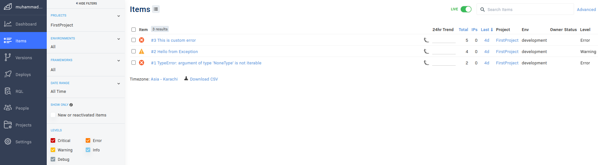
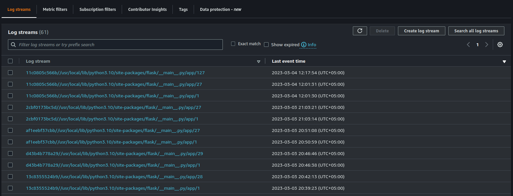

# Week 2 — Distributed Tracing

After watching your live stream, Ashish's & Chirag's Video, I've the challenges along with the stretched ones below.

# **Practical Implementaion of Challenges**

### **Configure Honeycomb on Python & React**

After digging up on honeycomb, I've implemented honeycomb tracing on python and react app for monitoring events and traces.

<br />
## HoneyComb Python Implementation

``` python
### app.py

# Import Honeycomb deps ----
from opentelemetry import trace
from opentelemetry.instrumentation.flask import FlaskInstrumentor
from opentelemetry.instrumentation.requests import RequestsInstrumentor
from opentelemetry.exporter.otlp.proto.http.trace_exporter import OTLPSpanExporter
from opentelemetry.sdk.trace import TracerProvider
from opentelemetry.sdk.trace.export import BatchSpanProcessor

# Initialize tracing and an exporter that can send data to Honeycomb
provider = TracerProvider()
processor = BatchSpanProcessor(OTLPSpanExporter())
provider.add_span_processor(processor)
trace.set_tracer_provider(provider)
tracer = trace.get_tracer(__name__)

### home_activities.py
## Home Activities Service
def run(logger):
        logger.info("Home activities in cloudwatch...")
        with tracer.start_as_current_span("home-activites-mock-data"):
            span = trace.get_current_span()
            now = datetime.now(timezone.utc).astimezone()
            span.set_attribute("app.now (current timezone)", now.isoformat())
            now = datetime.now(timezone.utc).astimezone()
            results = [{
              ...
            }]
            span.set_attribute("app.result_length", len(results))
            return results


# notifications_activities.py
from datetime import datetime, timedelta, timezone
from opentelemetry import trace
from opentelemetry.trace.status import Status, StatusCode


tracer = trace.get_tracer("notifications.activities")

class NotificationsActivities:
  def run():
    with tracer.start_as_current_span("notification-mock-span") as span:
      # Set attributes on the span
      span.set_attribute("notification", "cruddr")
    
      # Set the status of the span
      span.set_status(Status(StatusCode.OK, "Notification Initialized."))
      now = datetime.now(timezone.utc).astimezone()
      results = [{
        'uuid': '68f126b0-1ceb-4a33-88be-d90fa7109eee',
        'handle':  'Coco Melon',
        'message': 'I am a youtube channel',
        'created_at': (now - timedelta(days=2)).isoformat(),
        'expires_at': (now + timedelta(days=5)).isoformat(),
        'likes_count': 5,
        'replies_count': 1,
        'reposts_count': 0,
        'replies': [{
          'uuid': '26e12864-1c26-5c3a-9658-97a10f8fea67',
          'reply_to_activity_uuid': '68f126b0-1ceb-4a33-88be-d90fa7109eee',
          'handle':  'Worf',
          'message': 'This post has no honor!',
          'likes_count': 0,
          'replies_count': 0,
          'reposts_count': 0,
          'created_at': (now - timedelta(days=2)).isoformat()
        }],
      }]
      return results
```

<br />

## HoneyComb React Implementation

``` javascript
// services/tracing.js

// tracing.js
import { OTLPTraceExporter } from '@opentelemetry/exporter-trace-otlp-http';
import { WebTracerProvider, BatchSpanProcessor } from '@opentelemetry/sdk-trace-web';
import { ZoneContextManager } from '@opentelemetry/context-zone';
import { Resource }  from '@opentelemetry/resources';
import { SemanticResourceAttributes } from '@opentelemetry/semantic-conventions';

const exporter = new OTLPTraceExporter({
  url: 'https://api.honeycomb.io/v1/traces',
});

const provider = new WebTracerProvider({
  resource: new Resource({
    [SemanticResourceAttributes.SERVICE_NAME]: 'browser',
  }),
});

provider.addSpanProcessor(new BatchSpanProcessor(exporter));

provider.register({
  contextManager: new ZoneContextManager()
});

<br />
// notificationsFeedPage.js

import './NotificationsFeedPage.css';
import React from "react";
import { trace, context, SpanStatusCode, } from '@opentelemetry/api';


import DesktopNavigation  from '../components/DesktopNavigation';
import DesktopSidebar     from '../components/DesktopSidebar';
import ActivityFeed from '../components/ActivityFeed';
import ActivityForm from '../components/ActivityForm';
import ReplyForm from '../components/ReplyForm';

import '../services/tracing'

// [TODO] Authenication
import Cookies from 'js-cookie'

const tracer = trace.getTracer('notification-request.tracer');

export default function NotificationsFeedPage() {
  const [activities, setActivities] = React.useState([]);
  const [popped, setPopped] = React.useState(false);
  const [poppedReply, setPoppedReply] = React.useState(false);
  const [replyActivity, setReplyActivity] = React.useState({});
  const [user, setUser] = React.useState(null);
  const dataFetchedRef = React.useRef(false);

  const loadData = async () => {
    const backend_url = `${process.env.REACT_APP_BACKEND_URL}/api/activities/notifications`

    // Setup new span for notification service
    return tracer.startActiveSpan(`Notification Request: Get ${backend_url}`, async (span) => {

      // construct W3C traceparent header
      const traceparent = `00-${span.spanContext().traceId}-${span.spanContext().spanId}-01`;

      try {
        const res = await fetch(backend_url, {
          method: "GET",
          traceparent: traceparent,
        });

        // Set Span Attributes for http request
        span.setAttributes({
          'http.method': 'GET',
          'http.url': backend_url,
          'response.status_code': res.status,
        });

        let resJson = await res.json();
        if (res.status === 200) {

          // Set Span status for request status code
          span.setStatus({ code: SpanStatusCode.OK });
          setActivities(resJson)
        } else {
          console.log(res)
        }
      } catch (err) {
        console.log(err);
        // Set Span for any error message
        span.setStatus({
          code: SpanStatusCode.ERROR,
          message: err.message,
        });
        throw err;
      } finally {

        // finally end the span
        span.end();
      }
    });
  };
}
```


<br />

### **Configure Rollbar on Python**

``` python
# Import Rollbar Deps ---
import rollbar
import rollbar.contrib.flask
from flask import got_request_exception


## Rollbar init code. You'll need the following to use Rollbar with Flask.
## This requires the 'blinker' package to be installed
@app.before_first_request
def init_rollbar():
    """init rollbar module"""
    rollbar.init(
        # access token
        rollbar_access_token,
        # environment name
        'development',
        # server root directory, makes tracebacks prettier
        root=os.path.dirname(os.path.realpath(__file__)),
        # flask already sets up logging
        allow_logging_basic_config=False)

    # send exceptions from `app` to rollbar, using flask's signal system.
    got_request_exception.connect(rollbar.contrib.flask.report_exception, app)


# Rollbar testing function
@app.route('/rollbar/test')
def rollbar_test():
    rollbar.report_message("This is custom error", "warning")
    return "Hello World!"
```




<br />

### **Configure Cloudwatch on Python**

``` python
# Cloudwatch logger deps ---
import watchtower
import logging

# Configuring Logger to Use CloudWatch
LOGGER = logging.getLogger(__name__)
LOGGER.setLevel(logging.DEBUG)
console_handler = logging.StreamHandler()
cw_handler = watchtower.CloudWatchLogHandler(log_group='cruddur')
LOGGER.addHandler(console_handler)
LOGGER.addHandler(cw_handler)

LOGGER.info("Init log...")

# home_activities.py
class HomeActivities:
    def run(logger):
        logger.info("Home activities in cloudwatch...")
        {...}
        return results

```



